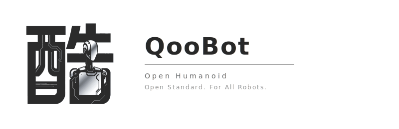
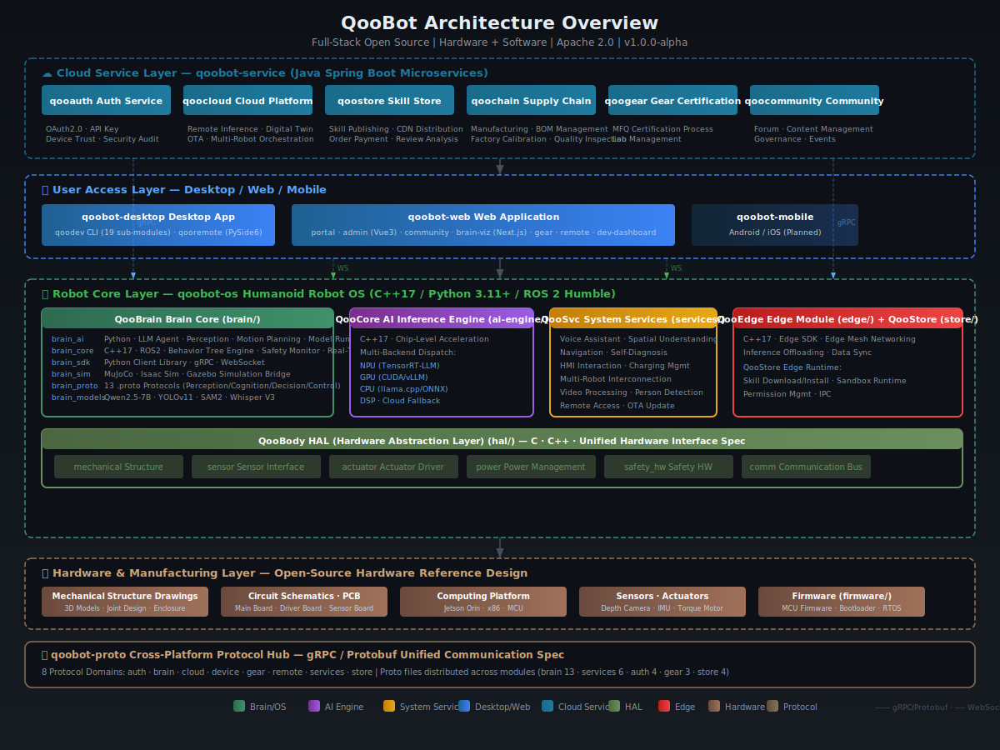

**Full-Stack Open Source · Hardware + Software**

From mechanical drawings and circuit design to operating systems and AI algorithms — fully open source, freely manufactured. Build your own humanoid robot.

  
  
  
  

  
  
  
  

---

## 🤖 QooBot — Full-Stack Open Source Humanoid Robot OS

> **Building a universal operating system for the next generation of physical AI** — centered on humanoid robots, spanning industrial, service, home, and all-scenario applications.

  

### 🏗 Architecture

  

### 🧩 Platform Overview

| Platform | Role | Tech Stack |
|:--|------|--------|
| **[qoobot-os](https://github.com/qoobots/qoobot)** | Humanoid Robot OS — HAL, AI engine, Brain core, system services, edge modules, skill store | `C++17` `Python` `ROS2` `MuJoCo` |
| **[qoobot-web](https://github.com/qoobots/qoobot)** | Web apps — brand portal, admin dashboard, community, brain 3D digital twin, remote control, dev dashboard | `Vue 3` `React` `Next.js` `Three.js` `WebRTC` |
| **[qoobot-desktop](https://github.com/qoobots/qoobot)** | Desktop tools — dev toolchain (qoodev v1.7.0), remote robot monitoring console | `Python 3.11+` `PySide6` |
| **[qoobot-service](https://github.com/qoobots/qoobot)** | Cloud microservices — auth, cloud platform, compliance, skill store, supply chain, accessory certification, community | `Java` `Spring Boot 3` `PostgreSQL` |
| **qoobot-mobile** | Mobile app — Android/iOS native *(planned)* | `Flutter` `Dart` |
| **[qoobot-proto](https://github.com/qoobots/qoobot)** | Cross-platform protocol — gRPC/Protobuf, 8 protocol domains | `Protobuf` `gRPC` |

> 📂 **[Explore the full QooBot project →](https://github.com/qoobots/qoobot)**

---

## 🧑‍💻 About Me

- 🔭 **Currently working on:** QooBot Humanoid Robot OS &amp; QooERP Enterprise ERP System
- 🌱 **Exploring:** Multimodal LLMs, AI Agent vertical industry deployment, Web3 + Decentralized Identity (DID)
- 👯 **Looking to collaborate on:** AI open-source projects, enterprise SaaS systems
- 💬 **Ask me about:** Java microservices, Spring Boot 3.x, AI Agent development, enterprise system design
- 📫 **Reach me:** [hello@qoobot.com](mailto:hello@qoobot.com)
- ⚡ **27+ open-source projects** across AI, ERP, cloud computing, e-commerce, Web3, robotics, and more

---

## 📦 Project Catalog

### 🤖 AI &amp; LLM

| Project | Description |
|:--|-------------|
| [qoocode](https://github.com/qoobots/qoocode) | Claude Code-style AI coding assistant CLI — 63+ slash commands, 34+ tools |
| [aicoding](https://github.com/qoobots/aicoding) | LLM intelligent code generation tool, batch enterprise-grade project generation |
| [openagent](https://github.com/qoobots/openagent) | AI Agent system covering 23 vertical domains — LangChain4J + Spring AI |
| [openllm](https://github.com/qoobots/openllm) | 10 vertical-domain LLM fine-tuning projects (Finance, Healthcare, Legal, Manufacturing, etc.) |
| [openlabeling](https://github.com/qoobots/openlabeling) | LLM data annotation platform |
| [qoowork](https://github.com/qoobots/qoowork) | AI office platform — all-scenario desktop AI assistant + IDE plugin |

### 🏢 Enterprise

| Project | Description |
|:--|-------------|
| [qooerp](https://github.com/qoobots/qooerp) | Next-gen open-source ERP — 100+ business modules, DDD + Microservices |
| [openaccounting](https://github.com/qoobots/openaccounting) | Enterprise accounting management (GL, reports, budgets, assets) |
| [opentax](https://github.com/qoobots/opentax) | Enterprise tax management (invoicing, filing, risk control, Golden Tax IV) |
| [openscm](https://github.com/qoobots/openscm) | Supply chain management (suppliers, procurement, inventory, logistics) |
| [openwarehouse](https://github.com/qoobots/openwarehouse) | Open-source WMS with 4-level warehouse hierarchy |
| [openidaas](https://github.com/qoobots/openidaas) | Enterprise IDaaS — OAuth2.1 + SAML 2.0 |
| [openadmin](https://github.com/qoobots/openadmin) | Modern enterprise application framework, complete microservice solution |

### ☁️ Platform &amp; Infrastructure

| Project | Description |
|:--|-------------|
| [opencloud](https://github.com/qoobots/opencloud) | Enterprise open-source cloud platform — VM + container dual architecture |
| [openlowcode](https://github.com/qoobots/openlowcode) | JavaFX desktop low-code code generation platform |
| [solra](https://github.com/qoobots/solra) | Next-gen decentralized virtual world (5G spatial social) |
| [openclaw](https://github.com/qoobots/openclaw) | Personal AI assistant supporting 25+ messaging channels |

### 🛒 E-Commerce &amp; Social &amp; Web3

| Project | Description |
|:--|-------------|
| [openmall](https://github.com/qoobots/openmall) | Production-grade B2B2C multi-merchant e-commerce platform |
| [openim](https://github.com/qoobots/openim) | WeChat-style instant messaging app (chat, moments, red packets) |
| [openrecommend](https://github.com/qoobots/openrecommend) | Multi-content intelligent recommendation system |
| [openweb3](https://github.com/qoobots/openweb3) | Web3 application scenarios &amp; architecture blueprint (20 scenarios + RWA/DePIN) |
| [openblog](https://github.com/qoobots/openblog) | QooBot official showcase (cyberpunk terminal style) |

---

  

### "Building enterprise-grade open source with AI, one commit at a time."

